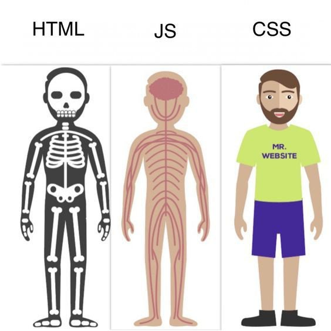

## Frontend

# **Change Propagation**

---

# What

- Pull/Push change to other parts in FE Eco

<!-- 

1. _Hiện "What"_

Change propagation (lan truyền thay đổi) là gì:

- Khi thay đổi 1 phần trong hệ thống sẽ dẫn đến sự thay đổi ở các phần khác có liên quan đến nó.
- Như các bánh răng liên kết với nhau khi ta xoay 1 bánh bất kì sẽ lan truyền động năng làm xoay các bánh còn lại.

2. _Hiện "Pull/Push.." và hình_

- Ở FE ta có sơ đồ lan truyền gồm các thành phần chính là User, Display, Webworker và Backend.
- Ngoài Webworker và Backend có thể tương tác trực tiếp thì các phần lan truyền thay đổi qua Display.

NOTE (ko nói):
- Như khi chiên trứng -> tăng lửa -> chảo nóng -> trứng chín -> tắt lửa -> chảo giảm nhiệt -> trứng không bị khét.

-->

---

<!-- THÊM HÌNH FOCUS PHẦN CHUẨN BỊ NÓI TRONG SƠ ĐỒ, KHOANH ĐỎ HAY GÌ ĐẤY -->

# User interaction

- Click, touch
- Typing
- Scrolling
- ...

<!--

1. Đầu tiên em xin nói về Thay đổi đến từ Tương tác của User:

- User thông qua các thiết bị vật lý như chuột, bàn phím, màn hình... Push và Pull thay đổi từ Display.

2. Ví dụ:

- User nhập form login rồi submit thì Display gọi lên Backend, đợi nhận kết quả login rồi Display render kết quả lại cho User.
- Trong ví dụ này, thay đổi đến từ User đã lan truyền qua Display tới Backend và ngược lại.

-->

---

# Display

- HTML: Structure & Content
- CSS: Style
- JS: Functionality

<!--

1. Display giữ vai trò nhận thay đổi từ các phần còn lại, xử lý rồi push thay đổi đến các phần cần thiết trong sơ đồ.

2. Display tạo thành từ 3 ngôn ngữ có chức năng khác nhau:

- HTML: Cấu trúc và nội dung -> tĩnh -> xương sống
- CSS: Giao diện -> tĩnh -> da, quần áo, vẻ ngoài
- JavaScript: Chức năng, tương tác -> đông -> bộ não, điều khiển mọi chức năng, hoạt động sống

NOTE (ko nói):
- Khi user truy cập web trên browser thì HTML sẽ load thành DOM cung cấp các method cho phép JavaScript truy cập và thay đổi.
- Get từ server (qua HTTP req/res) hoặc cache;
- HTML có thể qua <form action method> <button submit> để giao tiếp server mà ko cần JS, server process -> trả về HTML mới

-->

---

Propagate change:

- User: DOM Event -> JS -> ... -> DOM
- Webworker: DOM message Event -> JS -> ... -> DOM
- Backend: Network method -> JS -> ... -> DOM

<!-- 

3. Vậy làm sao để Display nhận biết (pull) thay đổi:

- Phía User: Gán event, state vào các element mà user có thể tương tác như button, input,...
- Phía Webworker: Event onmessage và postmessage
- Phía Backend: api, websocket...

4. Các DOM Event hay response từ BE sẽ được JS xử lý, tính toán lan và lan truyền đi cuối cùng quay lại update DOM cho User nếu cần thiết.

5. Ví dụ: User login thì JS lấy username và pass từ DOM gửi lên BE, đợi response login thành công thì JS update State của user thành đã login và thay đổi các Element tương ứng như đổi button login thành sign out, hiển thị username...

-->

---

Framework:

- React: Virtual DOM
- Vue: data-binding
- HTMX

<!-- 

React:

React uses a virtual DOM to track changes. When state changes in a component, React creates a new virtual DOM and compares it with the old one1.
This process is called “diffing”. React identifies the differences (or “diffs”) between the old and new virtual DOMs and updates only those parts in the real DOM1.
React uses synthetic events, which are wrappers around the browser’s native events. You can stop event propagation on synthetic events because React handles propagation of these events internally2.
However, stopping the propagation of one type of event (e.g., a change event) won’t affect the propagation of a different type of event (e.g., a click event)3.
React’s one-way data flow means that state is passed down from parent components to child components through props1. This makes state changes predictable but can make complex state management more challenging1.
Vue:

Vue also uses a virtual DOM and a diffing algorithm, similar to React4.
However, Vue extends this with a reactivity system. When you change a Vue instance’s data, the view automatically updates4.
Vue uses an event system that allows components to communicate with each other. Events in Vue can be triggered by user actions, component methods, or other components4.
Vue provides the .stop modifier for v-on to stop event propagation5.
Vue supports two-way data binding (with the v-model directive), which can make handling user input more straightforward4.
For complex state management, Vue relies on Vuex, a state management library6.
HTMX:

HTMX allows you to access modern browser features directly from HTML, rather than using JavaScript7.
It extends and generalizes the core idea of HTML as a hypertext, opening up many more possibilities directly within the language7.
Any element, not just anchors and forms, can issue an HTTP request7.
Any event, not just clicks or form submissions, can trigger requests7.
Any HTTP verb, not just GET and POST, can be used7.
Any element, not just the entire window, can be the target for update by the request7.
When a successful action occurs during a POST, the response includes an HX-Trigger response header that looks like this: HX-Trigger:newContact. This will trigger the table to issue a GET to /contacts/table and this will render the newly added contact row (in addition to the rest of the table)

-->

---

# Backend

- APIs
  - REST API:
    - BUILT-IN: FETCH / GET/POST
    - AXIOS
  - GRAPHQL:
    - APOLLO CLIENT
    - Urql
- WebSockets
  - BUILT-IN: new WebSocket
  - Socket.io

---

- Server-Sent Events (SSE)
  - BUILT-IN: const eventSource = new EventSource('http://localhost:8000/stream');
- Polling and Long-Polling
  - REACT-QUERY

---

| Method                       | Real-time | Bi-directional | Complexity | Browser Support |
| ---------------------------- | --------- | -------------- | ---------- | --------------- |
| HTTP Requests (RESTful APIs) | No        | No             | Low        | High            |
| WebSockets                   | Yes       | Yes            | Medium     | High            |
| Server-Sent Events (SSE)     | Yes       | No             | Medium     | Medium          |
| Long Polling                 | No        | No             | High       | High            |

---

# Web Worker

- JavaScript feature
- Independent background script
- Can't direct access to the DOM _but indirect through message pipeline_ <- how it propagate change
